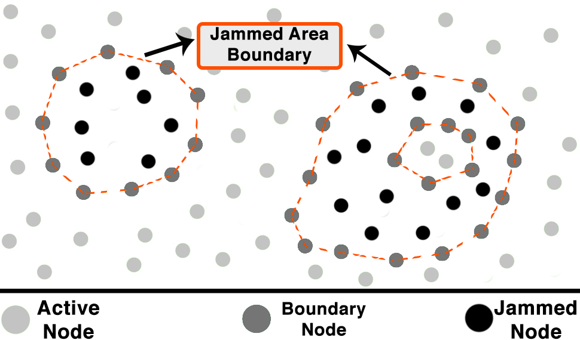
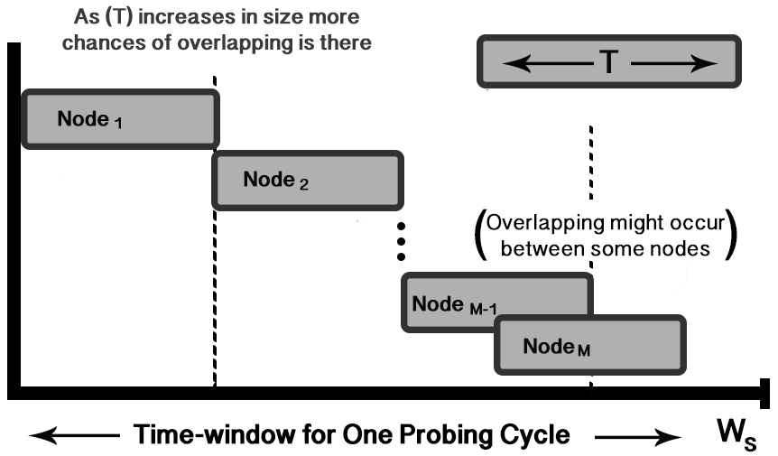
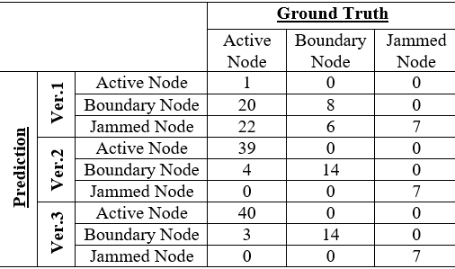
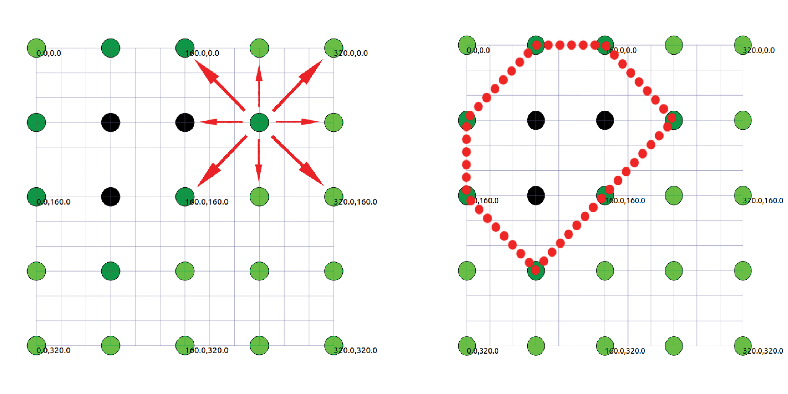

# Tracing-Jammed-Area-in-Wireless-Ad-hoc-Network-using-Boundary-Node-Detection
Paper published in IEEE International Symposium on Advanced Networks and Telecommunication Systems (ANTS), 2018. Link can be found [here](https://ieeexplore.ieee.org/document/8710095 "Tracing Jammed Area in Wireless Ad-hoc Network using Boundary Node Detection paper").

## Abstract
Ad-hoc Networks, which are based on wireless medium, are susceptible to various kinds of security threats. One such threat is the jamming attack where the attacker jams the wireless medium using high energy signals. This leads to the disruption in communication. This attack falls under the category of Denial of Service (DoS) attack. For military and disaster management services, where continuous and reliable communication is of utmost importance, this attack poses a serious threat. A potential solution to this problem is to use the automated jammed area mapping schemes, which can identify the jammed region and report it to the concerned authorities for taking required action. There exists a few jammed area mapping protocols, however they suffer from hurdles like extensive flooding, wasted bandwidth and low accuracy-rate. These schemes are based on receiving replies from the nodes located in the jammed region where the probability of sending and receiving messages is quite low. In this paper, we propose an algorithm which can locate the the jammed region without needing to rely on receiving messages from any jammed node. Our algorithm traces the boundary nodes with high accuracy in less amount of time. We performed the simulation of our algorithms using NS3 and observed an accuracy of around 95%, false-positive rate of 4.6% and zero false-negative in identifying the boundary nodes.

     

## Simulated Network Environment
For simulation we used NS3 (Network Simulator 3) - The simulated network consists of a wireless ad-hoc network grid of size 8*8 nodes with a distance of 80m between nodes and the wireless range is set to 100m. Seven nodes among them are selected as jammed node by setting their transmitting power to 0 dBm. While pinging the neighbors, if the message loss is smaller than 30%, then it is assumed that two nodes are connected.

## Result
We proposed two main variants of our proposed algorithms. Both were able to detect the jammed area by high accuracy by detecting the boundary nodes. Below is a table showing our results and a map of our simulation environment.

     
